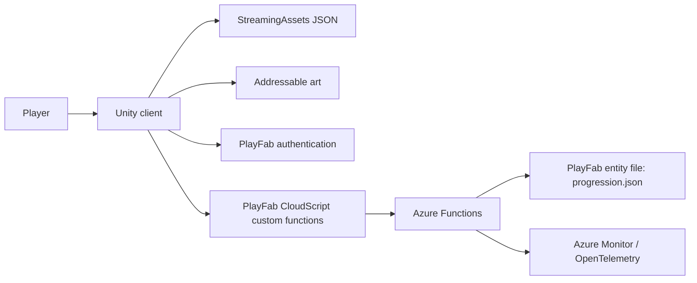
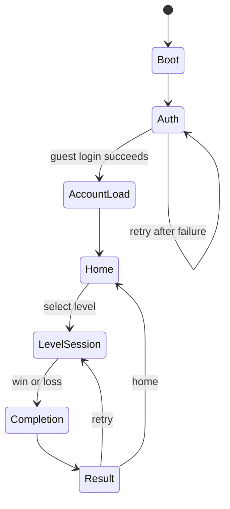
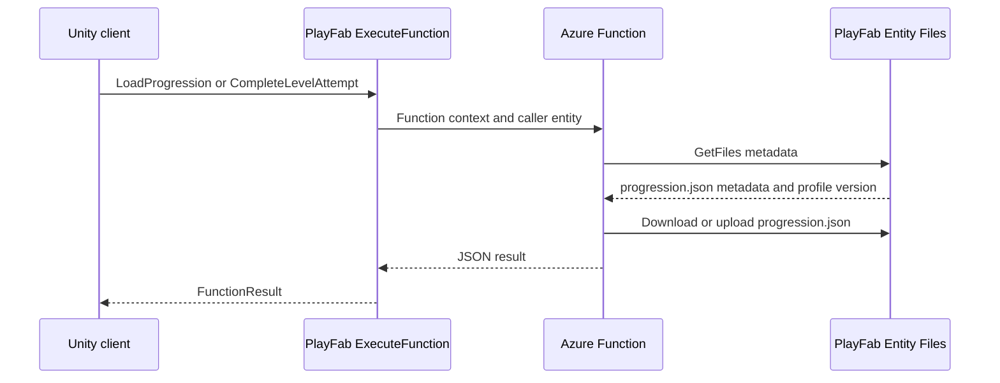
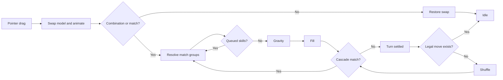

# BloomKeeper Architecture

## Purpose

This document describes the architecture currently implemented in BloomKeeper. It is a map of ownership, data flow, runtime boundaries, and known implementation limits. It is not a roadmap and does not describe planned systems as if they already exist.

The source code is authoritative when this document and the implementation disagree.

BloomKeeper is a Unity 6 (`6000.4.2f1`) portrait-oriented 2D match-3 game. The client contains the match simulation and presentation. PlayFab provides player authentication and invokes Azure Functions that own progression persistence.

## System Context

The repository contains the Unity client and the Azure Functions project. PlayFab title configuration and deployed Azure infrastructure live outside the repository.

## Runtime Topology

The enabled `MainGame` scene is a persistent application shell. Navigation does not load a new scene. Screens and the current board are shown, hidden, instantiated, or destroyed inside that shell.

| Owner | Responsibility | Lifetime |
| --- | --- | --- |
| `GameFlowController` | Composes application flows and coordinates navigation between them. | Scene lifetime |
| `UIManager` | Canvas-level UI facade split into feature-specific partial class files. | Application lifetime |
| `LevelSessionManager` | Owns the current level, gameplay managers, board instance, and result decision. | Application lifetime; session state is replaced per level |
| `SpriteLoader` | Loads and caches Addressable sprite atlases used by gameplay views. | Application lifetime |
| `PlayerAccountContext` | Holds the authenticated account and its in-memory progression. | Authenticated application session |
| `DialogManager` | Runs modal dialog workflows and resolves selected options asynchronously. | Application lifetime |
| `GameBoard` | Owns the live board model and serializes one turn through its state machine. | One level session |

`GameFlowController`, `LevelSessionManager`, `UIManager`, and `SpriteLoader` are Unity-facing composition points. Most gameplay rules are plain C# objects or static domain services. Unity views project domain state and animate changes after the model has already been mutated.

## Application Flow

`GameFlowController` creates the flow objects in `Awake` and enters boot from `Start`.

| Flow | Current responsibility |
| --- | --- |
| `BootFlow` | Configures the current frame-rate policy, loads sprite atlases, and exposes tester UI in editor/development builds. |
| `AuthFlow` | Shows the auth screen, prevents concurrent login attempts, and requests guest login. |
| `AccountLoadFlow` | Loads progression through the PlayFab/Azure boundary and creates `PlayerAccount`. |
| `HomeFlow` | Shows the level map, forwards level selection, and waits for initial map background loading. |
| `LevelSessionFlow` | Starts a level, controls player-action availability, and holds the session when a result is produced. |
| `LevelCompletionFlow` | Submits the level result and applies the server response to in-memory progression. |
| `ResultFlow` | Shows win or lose UI and publishes home or retry requests. |

Screen changes are commonly wrapped in `UIJawCurtain` transitions. UniTask is used to sequence asynchronous presentation and PlayFab work. C# events connect flow boundaries; each flow subscribes on entry and unsubscribes on exit.

## Authentication And Account State

Only guest authentication is implemented.

1. `GuestCustomIdStore` obtains or creates a persistent device-local custom ID.
2. `PlayFabGuestLoginService` calls `LoginWithCustomID` with account creation enabled.
3. The service uses the entity token included in the login result or requests one separately.
4. `PlayFabAuthSession` stores the PlayFab ID, session ticket, entity identity, entity token, expiration, guest custom ID, and newly-created flag.
5. `AccountLoadFlow` loads progression and creates a `PlayerAccount`.
6. `PlayerAccountContext` becomes the application-wide owner of that account for the active session.

`PlayFabAuthSession` is an immutable snapshot. Token refresh, logout, account switching, Google login, Apple login, account linking, and account merging are not implemented. The auth view contains a separate login button, but the current flow only binds guest play.

## Progression Backend

The client does not persist progression to an encrypted local save. Progression is loaded and updated through PlayFab custom functions backed by Azure Functions.

### Client Boundary

`PlayFabProgressionService` builds an authenticated `ExecuteFunctionRequest` from `PlayFabAuthSession`. It exposes two operations:

- `LoadProgression` returns `PlayerProgressionData`.
- `CompleteLevelAttempt` submits an attempt ID, level ID, win state, score, and stars, then returns updated progress for that level and the highest unlocked level.

Function results are converted through Newtonsoft.Json and rejected when required data is absent.

### Azure Boundary

The backend project is `Backend/BloomKeeper.PlayFabFunctions`.

- `LoadProgressionFunction` loads the caller's progression or creates and uploads a default document.
- `CompleteLevelAttemptFunction` loads progression with its profile version, applies an attempt, and uploads the updated document only when the attempt has not already been processed.
- `PlayFabFunctionContextReader` validates the PlayFab function context and constructs an entity-authenticated PlayFab Data API client.
- `PlayFabProgressionStore` owns serialization and the `progression.json` file contract.
- `PlayFabEntityFileClient` owns entity-file metadata, download, initiate-upload, HTTP upload, and finalize-upload calls.
- `CompleteLevelAttemptService` owns progression mutation, attempt-ID validation, duplicate detection, and conflicting attempt-ID rejection.

`PlayerProgressionData` contains a schema version, `highestUnlockedLevel`, a dictionary of per-level progress, and a server-private dictionary of processed level attempts keyed by canonical UUID. Each processed record retains the accepted request data so identical retries can be distinguished from conflicting UUID reuse. `LoadProgressionFunction` returns a client-facing response that excludes this private dictionary.

`LevelSessionManager` creates one UUID when it prepares a level. `LevelSessionResult` retains that UUID after gameplay finishes, so every submission retry uses the same idempotency key. The server records the request and progression mutation in the same `progression.json` write. An identical retry returns current authoritative progression without another write; invalid UUIDs and UUIDs reused with different request data are authoritative non-retryable rejections.

The entity profile version is supplied during writes, providing PlayFab's optimistic concurrency boundary. When file upload initiation reports `EntityProfileVersionMismatch` or `ConcurrentEditError`, the completion function discards its stale in-memory mutation, reloads progression, reapplies the idempotent attempt, and retries with bounded exponential backoff. After three conflicting writes it returns HTTP 409 so the client can treat the operation as retryable. The current implementation does not queue failed writes, compact processed-attempt records, or migrate schemas.

The backend currently verifies basic request sanity and whether the requested level is unlocked. It trusts the client's win flag, score, and stars; it does not replay or independently validate gameplay.

## Home And Level Selection

`HomeFlow` gives `PlayerProgressionData` to `UILevelSelect`.

- `LevelLoader.LoadLevelMetas` reads `level_meta.json`.
- `LevelMapButtonLayer` uses `VerticalScrollPool<LevelButton>` to virtualize authored button positions.
- Each visible button reads earned stars from the progression dictionary.
- `LevelMapBackgroundLayer` and `LevelMapChunkTextureCache` load visible Addressable background textures from the chunk manifest.
- Selecting a button raises a level ID through `UIManager` to `HomeFlow` and then `GameFlowController`.

The progression model contains `highestUnlockedLevel`, but level buttons currently do not enforce it. Every authored map button remains selectable.

## Level Session Composition

`LevelSessionManager` is the composition root for one playable level.

1. It clears the previous session and unsubscribes its events.
2. `LevelLoader` deserializes `level_<id>.json` into `LevelData`.
3. `ScoreManager` receives the level's star thresholds and loads global score rules from `score_config.json`.
4. `ObjectiveFactory` creates match and clear-spider-web objectives.
5. `ConstrainerFactory` creates move-limit and timer constraints.
6. `BoardInitializer` converts the row-major tile DTO list into the live `BoardCell[,]` model and fills unspecified petals without creating an initial match.
7. `UIManager` creates the HUD from objective, constraint, score, and star data.
8. The manager shows the world background, instantiates `GameBoard`, passes it the model and available play-area rectangle, and enables player actions.

The manager owns `ObjectiveManager`, `ConstrainerManager`, and `ScoreManager` for the session. It also mediates the end-of-turn rule: objective completion and move-limit failure can occur during cascades, but the final win or loss is emitted only after the board reports that the turn has settled.

## Board Domain Model

`BoardCell[,]` is the authoritative live board state.

| Type | Responsibility |
| --- | --- |
| `BoardCell` | Holds void state, a tile, and the current petal; delegates cell capabilities to the tile. |
| `Tile` hierarchy | Defines matching, swapping, gravity, refill, clear effects, obstacles, and adjacent-match reactions. |
| `NormalTile` | Standard playable tile behavior. |
| `InactiveTile` | Blocks normal board participation. |
| `WebTile` | Owns clearable web state and changes behavior as the obstacle is damaged. |
| `Petal` | Holds petal type and special-skill type. |

A void cell is distinct from a non-void cell containing an inactive tile. Board rules query `BoardCell` capabilities instead of distributing tile-type checks throughout the turn coordinator.

The model is mutated first. `PetalViewManager`, `TileViewManager`, `MatchPresentationCoordinator`, and board VFX then consume explicit result data to update the visual projection.

## Turn State Machine

`GameBoard` is the sole coordinator of board mutation and turn sequencing. Input is accepted only while the board is idle and player actions are enabled.

| State | Responsibility |
| --- | --- |
| `Idle` | Accept a swap or tester action and detect deadlock. |
| `Swapping` | Swap petals, animate them, detect swap combinations or resulting matches, and commit a valid player move. |
| `SwappingBack` | Restore and animate an invalid swap. |
| `Resolving` | Apply match groups, emit gameplay events, and present the resulting changes. |
| `ActivatingSkills` | Convert queued skill activations into new match groups. |
| `Gravity` | Mutate downward movement and animate reported moves. |
| `Filling` | Create petals for receivable empty cells and animate entry. |
| `Cascade` | Detect matches after refill; either resolve again or settle the turn. |
| `Shuffling` | Replace matchable petals when no legal move exists, then re-enter cascade detection. |

### Match And Skill Services

- `PetalSwapper` validates and performs adjacent swaps.
- `MatchDetector` identifies line, T, L, cross, and square match shapes.
- `MatchResolver` applies groups to the model and returns cleared petals, tile changes, spawned skills, and queued activations.
- `SkillDetector` recognizes combinations caused directly by the two swapped petals.
- `SkillManager` converts stripe, Bouquet, Prismatic Bloom, Butterfly, and combination activations into affected match groups.
- `GravityController`, `PetalFiller`, `DeadlockDetector`, and `BoardShuffler` own their respective board operations.

`pendingMatches` and `pendingSkillActivations` carry work between states. Skills discovered during resolution are converted back into match groups, so normal matches, chained skills, gravity, refill, and cascades use one repeated pipeline.

## Gameplay Event Boundary

`GameBoard` reports domain events rather than calling score, objective, or constraint systems directly.

| Event | Primary consumers |
| --- | --- |
| `PlayerMoveCommittedEvent` | Move constraint and turn-settling state |
| `BoardResolvedEvent` | Score calculation and other gameplay reporting |
| `PetalsClearedEvent` | Match objectives |
| `SpiderWebClearedEvent` | Clear-spider-web objectives |

`LevelSessionManager` forwards every gameplay event to `ObjectiveManager` and `ConstrainerManager`; it passes board-resolution events to `ScoreManager`. This keeps the board independent from level goals, limits, scoring rules, and UI.

`ScoreManager` calculates score from data-driven rules for cleared petals, cascade depth, web clearing, match shapes, and skill activation. It derives stars from thresholds stored in each level.

## Presentation And Input

`UIManager` is a partial singleton facade. Each feature-specific partial file owns the prefab instance, event binding, and show/hide behavior for one UI area.

### Reference-Driven Objective HUD

The objective HUD keeps references to the live `IObjective` instances created for the level. `ObjectiveBoard` binds each spawned widget to a getter for one objective view item. An objective event therefore travels through the UI layers only as a refresh notification; the updated objective view data is not copied through `LevelSessionManager`, `UIManager`, `UILevelUI`, and `UILevelHud`.

On refresh, each widget pulls its latest `ObjectiveViewData` through its stored getter and compares the remaining amount with the amount it previously displayed. That comparison controls presentation only: unchanged items stay still, progressed items animate, and newly completed items animate and enter their completed visual state. `ObjectiveManager` remains the authority for gameplay completion and the level's win condition.

`ObjectiveBoard` coordinates one objective sound per refresh after collecting the widgets' presentation outcomes. A completion sound takes priority over a progress sound when several items change together. The board owns when objective audio is presented; `AudioService` continues to own playback, pooling, mixer routing, volume, and pause behavior.

Current UI areas include:

- authentication;
- virtualized level selection;
- level HUD, objectives, constraints, score, and stars;
- win and lose screens;
- booster-board layout placeholder;
- reusable dialogs and backdrop;
- jaw-curtain transitions and tips;
- development tester controls and petal editing.

`BoardLayoutCalculator` uses the camera, safe area, HUD/booster geometry, board dimensions, and the provided screen rectangle to calculate a stable world-space board layout. `BoardInputHandler` maps the Unity Input System pointer to board cells and supports the same drag interaction for mouse and touch.

Petal and tile views are separate from their model objects. View managers retain coordinate-aligned projections and object pools, while animator components own DOTween/UniTask presentation timing. `BoardVFXManager` owns board-level effects that do not belong to one persistent view.

## Content And Asset Pipeline

| Source | Runtime use |
| --- | --- |
| `StreamingAssets/levels/level_<id>.json` | Board dimensions, tiles, petals, star thresholds, objectives, and constraints |
| `StreamingAssets/levels/level_meta.json` | Level-map labels and authored positions |
| `StreamingAssets/score_config.json` | Score rules |
| `StreamingAssets/levels/level_path_bg_manifest.json` | Ordered Addressable level-map background chunks |
| Addressable sprite atlases | Petal, tile, obstacle, and other runtime sprites |

`LevelLoader`, `ScoreLoader`, and `AssetManifestLoader` currently use direct filesystem reads and Newtonsoft.Json deserialization. There is no schema validation, remote manifest, download cache, content version negotiation, or last-known-good rollback.

The first-party editor tools support content authoring but are not runtime dependencies:

- `LevelPositionExporter` exports level-map positions.
- `AddressableMetadataExporter` exports background chunk metadata.
- `TexturePackerImporter` imports TexturePacker data.
- `SpriteRenamer` supports sprite naming conventions.

## Failure And Recovery Behavior

The current failure model is incomplete:

- Guest login failure is surfaced through a retry/cancel dialog.
- Account-load and level-completion failures are not converted into dedicated recoverable flow states.
- There is no durable offline result queue or reconnect synchronization.
- Entity profile-version conflicts are retried server-side up to the bounded policy; continued contention returns a retryable failure to the client.
- Content loaders deserialize directly and do not validate semantic consistency before session construction.
- Required Unity references are primarily supplied through scene and prefab serialization.

## Test Boundary

The repository contains two PlayMode test files. They use reflection and still construct the removed `Tile[,]` board shape and a removed `Rose` petal enum value. They do not currently represent reliable coverage of the implemented `BoardCell[,]` architecture. The Azure Functions project has no first-party automated tests.

## External Dependencies

### Unity Client

- Unity 6 and Universal Render Pipeline
- Unity UI and TextMeshPro
- Unity Input System
- Unity Addressables
- Newtonsoft.Json
- Cysharp UniTask
- DOTween
- PlayFab Unity SDK

### Azure Backend

- .NET 10
- Azure Functions v4 isolated worker
- PlayFab .NET SDK
- Newtonsoft.Json
- OpenTelemetry with Azure Monitor exporter

## Current Architectural Invariants

These statements describe the boundaries the current implementation relies on:

1. `GameFlowController` owns application navigation; individual screens do not choose the next application state.
2. `LevelSessionManager` owns one level session and is the only layer that decides its final win or loss.
3. `GameBoard` owns turn ordering and the authoritative `BoardCell[,]` model.
4. Presentation follows model mutation and receives explicit change/result data.
5. Gameplay events separate board mechanics from objectives, constraints, and scoring.
6. `PlayerAccountContext` owns the active authenticated account in memory.
7. Azure Functions, not the Unity client, own persisted progression mutations.
8. JSON DTOs are converted into runtime domain objects at loader and factory boundaries.

## Implemented Versus Missing

| Area | Implemented | Not implemented |
| --- | --- | --- |
| Authentication | PlayFab guest account and entity session | Google, Apple, linking, merging, logout, refresh, deletion |
| Progression | Azure-backed load, level-completion persistence, UUID idempotency keys, and bounded profile-conflict retry | Offline queue, processed-attempt compaction, migration |
| Gameplay validation | Basic backend sanity checks | Deterministic replay or authoritative result validation |
| Content | Local JSON and Addressable art | Remote hotfix pipeline, validation, cache, rollback |
| Economy | Booster-board presentation placeholder | Currency, inventory, rewards, shop, IAP |
| Player experience | Mouse/touch gameplay and safe-area-aware layout components | Audio system, haptics, localization, accessibility settings |
| Operations | Azure backend telemetry exporter | Client analytics, crash reporting, CI/CD |
| Social | None | Verified leaderboards or other player interaction |
| Navigation | Home, play, result, home/retry paths | Enforced level locks and connected win-screen next action |
