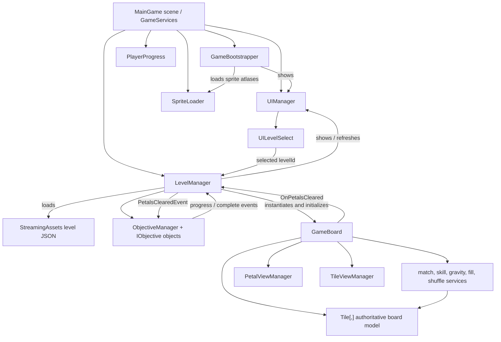
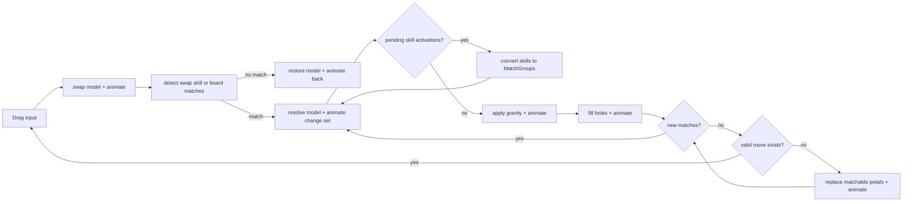

# BloomKeeper Architecture

## Scope

This document describes the architecture currently implemented in the repository. It covers the runtime game, its serialized Unity composition, data files, and first-party editor tooling. It is descriptive only: it does not propose changes or refactors.

The project is a Unity 6 (6000.4.2f1) 2D match game. The build contains one scene, `Assets/Scenes/MainGame.unity`. That scene acts as a persistent application shell; level selection and gameplay are shown by instantiating UI and board prefabs into the same scene rather than by changing scenes.

## Architectural overview

The runtime is organized around four layers of responsibility:

1. **Application services in the main scene** — `GameBootstrapper`, `UIManager`, `LevelManager`, `PlayerProgress`, and `SpriteLoader` are placed on the scene's `GameServices` object. The latter four use the project's `Singleton<T>` base and survive scene loads through `DontDestroyOnLoad`.
2. **Session orchestration** — `LevelManager` loads one level, creates its objectives and model grid, creates the scoreboard, and owns the currently instantiated `GameBoard`.
3. **Board domain and turn pipeline** — `GameBoard` owns the live `Tile[,]` model and is the sole coordinator of swaps, matching, skills, gravity, refill, cascades, and deadlock shuffling. Mostly stateless domain services mutate or query that grid.
4. **Presentation** — `UIManager` owns screen/popup instances. `PetalViewManager` and `TileViewManager`, which are components of the board prefab, maintain visual arrays corresponding to the model grid and animate change sets emitted by board operations.



## Startup and main gameplay flow

### Application startup

1. Unity loads the only enabled build scene, `MainGame`.
2. `PlayerProgress.Awake` constructs a `LocalProgressRepository` and loads `progress.dat` from `Application.persistentDataPath`, or creates empty progress when the file does not exist.
3. `GameBootstrapper.Start` awaits `SpriteLoader.LoadAll`. Sprite atlases named in the serialized `atlasKeys` list are loaded through Addressables and cached.
4. Development and editor builds show the tester/admin toggle.
5. `UIManager.ShowLevelSelect` instantiates or reuses the level-select prefab.

### Level selection

`UILevelSelect.Awake` initializes two independently pooled parts of the scrolling map:

- `ScrollMapBGController` reads the map chunk manifest, calculates vertically stacked chunk positions, and loads visible texture chunks by Addressables.
- `ScrollMapController` reads `level_meta.json` and virtualizes `LevelButton` objects at authored pixel positions.

Each visible `LevelButton` reads its star sprite from `PlayerProgress`. Clicking it passes the `levelId` to `LevelManager.InitNewLevel` and hides level selection.

### Starting a level

`LevelManager.InitNewLevel` performs the level composition:

1. `LevelLoader` deserializes `StreamingAssets/levels/level_<id>.json` into `LevelData`.
2. `ObjectiveFactory` converts each `ObjectiveJson` into an `IObjective`; currently only `MatchObjective` is implemented.
3. A new plain C# `ObjectiveManager` owns those objectives and is wired to `LevelManager` through progress and completion events.
4. `BoardInitializer` converts the row-major JSON tile list into a bottom-origin `Tile[,]`. `TileFactory` creates tile polymorphs and `PetalFactory` creates their petals. Random cells are filled while avoiding an initial match.
5. `UIManager` creates or refreshes the scoreboard directly from the same objective objects.
6. `LevelManager` destroys the preceding board instance if present, instantiates the serialized `GameBoard` prefab, calls `Init(grid)`, and subscribes to `OnPetalsCleared`.

### Playing a turn

`BoardInputHandler` uses the Unity Input System's current pointer. Outside admin mode, a drag resolves to one cardinal neighbor and raises `OnSwapRequested`. `GameBoard` accepts requests only in `Idle` and only when `PetalSwapper.Validate` accepts both cells.

The board immediately mutates the model for each operation and then awaits the corresponding view animation. A normal accepted swap follows this pipeline:



Every match resolution publishes the cleared petal types. `LevelManager` wraps them in `PetalsClearedEvent`, and `ObjectiveManager` reports that event to all objectives. A `MatchObjective` decrements the matching `PetalGoal.amount` values. Objective progress refreshes the scoreboard; completion causes `UIManager` to instantiate the win screen.

The current completion path displays the win screen only. The runtime contains star persistence and star display, but level completion does not currently call `PlayerProgress.SetStars`.

## Board state machine

`GameBoard` implements a private, explicit state machine. `TransitionTo` sets the state and immediately invokes its entry method. Async entry methods await presentation work before making the next transition. Input methods guard on `Idle`, so animations and resolution form a serialized turn transaction from the player's perspective.

| State | Responsibility | Outgoing transition |
| --- | --- | --- |
| `Idle` | Accept swap or admin edit input; test the settled board for a valid move. | `Swapping` on a valid request; `Shuffling` on deadlock. |
| `Swapping` | Clear pending turn data, swap the two model petals, animate, detect swap-triggered skill combinations, otherwise detect matches. | `Resolving` when a skill or match exists; `SwappingBack` otherwise. |
| `SwappingBack` | Animate the already-restored invalid swap. | `Idle`. |
| `Resolving` | Run `MatchResolver`, collect triggered skills, publish cleared types, and await tile/petal view updates in parallel. | `ActivatingSkills`. |
| `ActivatingSkills` | Convert every queued `SkillActivation` into a `MatchGroup` through `SkillManager`. | `Resolving` if activations existed; `Gravity` otherwise. |
| `Gravity` | Move petals downward in the model and animate the reported moves. | `Filling`. |
| `Filling` | Create random petals in receivable cells and animate entry from above. | `Cascade`. |
| `Cascade` | Detect matches over the settled grid. | `Resolving` if found; `Idle` otherwise. |
| `Shuffling` | Replace every matchable petal with a random petal and animate replacement. | `Cascade`. |

Two pieces of pending state carry data between entries:

- `pendingMatches` holds match groups awaiting resolution.
- `pendingSkillActivations` holds skills discovered while clearing. Skills are repeatedly converted back into match groups, allowing chained skills to use the same resolution path.

`swapOrigin` and `swapTarget` remain the placement preference for special petals formed during the turn; cascade matches fall back to shape-specific deterministic placement.

## Core systems and responsibilities

### Application and lifecycle

| System | Responsibility |
| --- | --- |
| `GameBootstrapper` | Orders initial sprite loading and initial UI display. |
| `Singleton<T>` | Scene lookup-backed global access, duplicate destruction, and `DontDestroyOnLoad` lifetime. |
| `GlobalState` | Static admin-mode flag and change event. |
| `UIManager` | Singleton UI facade, split across partial class files by feature; owns canvas-level panel/popup instances. |
| `LevelManager` | Owns the current level session: objective manager, board instance, and their event wiring. |

### Level and board model

| System | Responsibility |
| --- | --- |
| `LevelLoader` | Synchronous JSON loading of level definitions and level-map metadata from StreamingAssets. |
| `LevelData`, `TileData`, `ObjectiveJson`, `LevelMeta*` | Deserialization DTOs for authored content. |
| `BoardInitializer` | Builds coordinates, tile objects, and initial petals; prevents initial free matches for randomly authored cells. |
| `TileFactory` | Maps `TileType` to `NormalTile`, `InactiveTile`, or `WebTile`. |
| `Tile` hierarchy | Encapsulates whether a cell matches, participates in gravity, receives petals, resolves, and reacts to adjacent clears. |
| `Petal` | Immutable petal type and skill value; determines petal matchability. |
| `PetalFactory` | Constructs configured, explicit, or random petals. |
| `GameBoard` | Owns the authoritative grid and coordinates the complete turn state machine. |

`NormalTile` clears its petal and freely participates in gravity. `InactiveTile` blocks matching, fill, and gravity. `WebTile` blocks these behaviors while its web level is positive; adjacent resolved cells reduce that level. Once the web reaches zero it behaves as an available cell while retaining `TileType.Web` for its base view.

### Match and skill pipeline

| System | Responsibility |
| --- | --- |
| `PetalSwapper` | Validates normal occupied cells and exchanges their `Petal` references. |
| `MatchDetector` | Scans the entire grid, finds horizontal/vertical runs and 2x2 squares, assigns shapes, and prevents a cell from belonging to more than one returned group. |
| `MatchGroup` | Common work unit: positions, shape, optional causing petal, and skill-combination marker. |
| `MatchResolver` | Mutates matched tiles, selects and creates resulting special petals, collects triggered skills and cleared types, and notifies neighboring tiles. |
| `MatchResolveResult` | Change set passed from model resolution to board presentation and objective reporting. |
| `SkillDetector` | Dispatch table for skill combinations triggered directly by swapping two cells. Current handlers cover Sunburst with a normal petal and Sunburst with either stripe. |
| `SkillManager` | Converts a skill activation into a `MatchGroup` representing its affected cells. Implements stripes, Bouquet, Sunburst, Butterfly, and Stripe–Sunburst. |
| `GravityController` | Pulls the nearest reachable petal downward within each column and returns source/destination moves. |
| `PetalFiller` | Fills empty gravity-affected cells with random petals. |
| `DeadlockDetector` | Temporarily swaps adjacent model petals to find any match-producing move; treats a Sunburst adjacency as valid. |
| `BoardShuffler` | Replaces all matchable petals with fresh random petals and returns affected positions. |

Match-shape output is encoded in `MatchResolver`: four creates a horizontal or vertical stripe, five creates a Sunburst, T/L/Cross creates a Bouquet, and a 2x2 square creates a Butterfly. A match already containing a skilled petal triggers that petal instead of creating another special petal.

### Objectives and progression

| System | Responsibility |
| --- | --- |
| `ObjectiveFactory` | Creates the concrete objective selected by `ObjectiveType`. |
| `IObjective` | Objective contract for event reporting, completion checks, and view-data projection. |
| `MatchObjective` | Mutates its `PetalGoal` counters in response to `PetalsClearedEvent`. |
| `ObjectiveManager` | Broadcasts objective DTOs, then publishes progress and all-complete events. |
| `PlayerProgress` | Singleton owner of loaded `ProgressData`; reads/writes per-level star counts. |
| `IProgressRepository` | Persistence boundary for progress. |
| `LocalProgressRepository` | JSON serialization plus AES encryption to local `progress.dat`. |

Objectives are independent of the board model. Their only runtime input is an `ObjectiveDTO` reported by `LevelManager`. UI reads objective state through `GetViewData` rather than owning separate progress values.

### Presentation

| System | Responsibility |
| --- | --- |
| `PetalViewManager` | Owns a `PetalView[,]` parallel to the model grid and an object pool; applies swap, clear, special spawn, gravity, fill, shuffle, and tester refresh visuals. |
| `PetalView` / `PetalViewAnimator` | Sprite selection, sizing, and DOTween/UniTask animations for one petal. |
| `TileViewManager` | Owns a `TileView[,]`, renders base/overlay sprites, and animates overlay changes reported by resolution. |
| `TileView` / `TileViewAnimator` | Base and overlay renderers, sizing, and overlay transition animations. |
| `BoardLayoutCalculator` / `BoardLayout` | Converts camera, safe area, scoreboard height, padding, and board dimensions into cell size and world positions. |
| `BoardMeshBuilder` | Builds one textured quad per non-inactive tile behind the board. |
| `BoardInputHandler` | Pointer-to-cell conversion, cardinal drag input, and admin-mode double-tap edit requests. |
| `SpriteLoader` / `SpriteKeyHelper` | Addressable atlas cache and naming-convention lookup for petal, tile, and web sprites. |
| `UIScoreBoard` | Instantiates one widget per objective view item and retains closures that re-read live objective data on refresh. |
| `UILevelSelect` and scroll controllers | Virtualized map backgrounds and level buttons. |
| `VerticalScrollPool<T>` | Generic viewport-buffered pooling used by both parts of the level map. |

The `GameBoard` prefab owns `GameBoard`, `BoardInputHandler`, `PetalViewManager`, and `TileViewManager` components and their referenced view prefabs. The scene-owned `LevelManager` owns the board prefab reference. The scene-owned `UIManager` owns references to the canvas and every UI prefab.

## Ownership and lifetime

| Owner | Owned state or instances | Lifetime |
| --- | --- | --- |
| `GameServices` scene object | Bootstrapper and singleton service components. | Application shell; singleton components are marked persistent. |
| `SpriteLoader` | Loaded sprite atlas dictionary. | Application lifetime; Addressable atlas handles are retained through the loaded assets. |
| `UIManager` | Level select, scoreboard, win screen, tester toggle, petal editor, and backdrop instances. | Application lifetime; individual panels are hidden, reused, or replaced according to each feature method. |
| `LevelManager` | Current `ObjectiveManager` and current `GameBoard`. | Application lifetime, with owned session objects replaced per selected level. |
| `ObjectiveManager` | Concrete objective list. | One selected level. |
| `GameBoard` | `Tile[,]`, layout, turn state, pending work, and board-local component references. | One selected level. |
| `PetalViewManager` | Petal view array and pool. | One board instance. |
| `TileViewManager` | Tile view array and instantiated tile views. | One board instance. |
| `PlayerProgress` | `ProgressData` and repository. | Application lifetime; persisted on `SetStars`, pause, and quit. |

The `Tile[,]` is the authoritative gameplay state. View arrays are projections keyed by the same coordinates. Tiles own their current `Petal` reference; petals do not know their position or owner. No separate board repository or global gameplay state exists.

## Data flow between systems

### Authored level to live board

```text
level_<id>.json
  -> LevelLoader / LevelData DTO
  -> ObjectiveFactory -> ObjectiveManager
  -> BoardInitializer -> Tile[,] with Tile and Petal domain objects
  -> GameBoard.Init
  -> BoardLayout + board mesh + TileView[,] + PetalView[,]
```

The JSON tile list is interpreted from top row to bottom row. `BoardInitializer` maps it into `grid[x, y]` with `y = 0` at the visual bottom.

### Turn mutation to presentation

```text
BoardInputHandler event
  -> GameBoard state transition
  -> static domain operation mutates Tile[,]
  -> operation returns MatchResolveResult / positions / moves
  -> PetalViewManager and TileViewManager update parallel visual state
  -> GameBoard awaits animation completion
  -> next state transition
```

`MatchResolveResult` carries cleared positions and types, queued skill activations, special-petal spawns, changed tile overlays, and the two positions consumed by a skill combination. Gravity, fill, and shuffle use smaller position/move lists rather than the common result type.

### Objective flow

```text
MatchResolver.ClearedPetalTypes
  -> GameBoard.OnPetalsCleared
  -> LevelManager.ReportCleared
  -> PetalsClearedEvent
  -> ObjectiveManager.Report
  -> MatchObjective counters
  -> OnProgressUpdated -> scoreboard refresh
  -> OnAllComplete -> win screen
```

### Asset and map flow

```text
Addressable sprite atlases -> SpriteLoader cache -> sprite-key consumers
level_path_bg_manifest.json -> ScrollMapBGController -> visible Addressable textures
level_meta.json -> ScrollMapController -> pooled LevelButton positions
progress.dat -> PlayerProgress -> LevelButton star sprite
```

Large level-path backgrounds are independently Addressable and viewport-loaded. Level gameplay JSON and metadata are direct filesystem reads from StreamingAssets.

## Architectural patterns currently used

- **Single-scene application shell:** navigation is prefab visibility/instantiation inside one persistent scene.
- **Service locator / MonoBehaviour singleton:** systems reach `UIManager.Instance`, `LevelManager.Instance`, `PlayerProgress.Instance`, and `SpriteLoader.Instance` directly.
- **State machine:** `GameBoard.BoardState` serializes turn phases and prevents input during board mutation and animation.
- **Model–view separation:** plain `Tile`/`Petal` objects form the model; `TileView`/`PetalView` objects form the Unity presentation. Manager arrays keep them coordinate-aligned.
- **Orchestrator plus stateless domain services:** `GameBoard` coordinates static detector, resolver, gravity, fill, shuffle, factory, and skill classes.
- **Event-driven boundaries:** input, board clear reporting, objective progress/completion, popup confirmation, and admin state use C# events or Unity UI listeners.
- **Factory pattern:** tile, petal, and objective construction is centralized in dedicated factories.
- **Strategy through polymorphism:** tile behavior varies through the abstract `Tile` contract; objectives vary through `IObjective`; progress storage varies through `IProgressRepository`.
- **DTO/event object:** JSON-specific types stay at the loading boundary, while objective notifications use `ObjectiveDTO` subclasses.
- **Command/result-like change sets:** match resolution and movement operations mutate the model and return the exact information required by presentation and objectives.
- **Object pooling and virtualization:** petal views are pooled, and the level map uses a reusable generic scroll pool for buttons and background chunks.
- **Partial facade:** feature-specific files extend the single `UIManager` partial class.
- **Convention-based asset lookup:** enum values are converted into sprite names by `SpriteKeyHelper` and resolved from preloaded atlases.
- **Data-driven content:** level geometry, initial petals/skills, objectives, level-map positions, and background chunk metadata live in JSON rather than gameplay code.
- **Repository abstraction:** `PlayerProgress` depends on `IProgressRepository`, currently implemented by encrypted local-file persistence.
- **Async presentation sequencing:** UniTask and DOTween make animation completion part of board-state progression; tile and petal animations for one resolution run concurrently.

## Content and editor architecture

Runtime-authored content lives under `Assets/StreamingAssets/levels`:

- `level_<id>.json`: board dimensions, ordered tile DTOs, and objective DTOs.
- `level_meta.json`: level IDs, display names, and map coordinates relative to a reference width.
- `level_path_bg_manifest.json`: ordered Addressable background texture metadata.

The `Assets/Editor` tools support this pipeline:

- `LevelPositionExporter` provides the level-position editing/export workflow for `level_meta.json`.
- `AddressableMetadataExporter` exports Addressable image metadata used by the scrolling background.
- `TexturePackerImporter` imports TexturePacker JSON/sprite-sheet data.
- `SpriteRenamer` provides editor-side sprite renaming.

The existing `Assets/Documentation/Workflow.md` documents the map-chunk and level-button authoring sequence. These tools write content consumed by the runtime loaders; they are not runtime dependencies.

## External runtime dependencies

- Unity Universal Render Pipeline and 2D renderer
- Unity UI and TextMeshPro
- Unity Input System
- Unity Addressables
- Newtonsoft.Json
- Cysharp UniTask
- DOTween

Clipper2 is vendored under `Assets/Plugins`, but no first-party runtime script currently references it.
